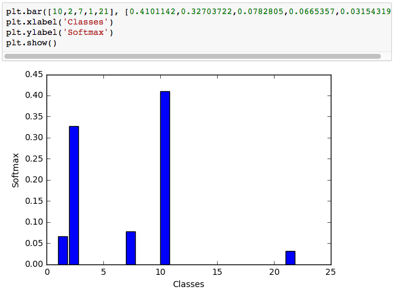

# Project Review: Traffic Sign Classification
A part of the Self Driving Car Engineer Nanodegree Program
 
**Meets Specifications**

Excellent work, you nailed it!
:clap::clap::clap:

I can see you put a lot of effort in your project and advanced a lot, you should be really proud!

You have shown a firm grasp of the concepts presented here and are good to go.

Keep going and good luck!
Paul

## Dataset Exploration

*The submission includes a basic summary of the data set.*

Good job completing the basic data summary.

*The submission includes an exploratory visualization on the dataset.*

Awesome

Excellent exploration of the dataset, I can see you put a lot of effort here.

## Design and Test a Model Architecture

*The submission describes the preprocessing techniques used and why these techniques were chosen.*

Good job preprocessing the data.

Suggestion

A good idea here is to normalize the image data into a range such as [-1, 1]. This means your input will get roughly zero mean and equal variance, turning it in a well conditioned problem and making it easier for the optimizer to go and find a good solution.

You can find more information on the [course](https://classroom.udacity.com/nanodegrees/nd013/parts/fbf77062-5703-404e-b60c-95b78b2f3f9e/modules/6df7ae49-c61c-4bb2-a23e-6527e69209ec/lessons/91cc6685-08df-4277-b53d-3a792b02420d/concepts/71191606550923) (Normalized Inputs And Initial Weights section, YH)

Another idea here is to perform [histogram equalization](http://docs.opencv.org/3.1.0/d5/daf/tutorial_py_histogram_equalization.html).

*The submission provides details of the characteristics and qualities of the architecture, including the type of model used, the number of layers, and the size of each layer. Visualizations emphasizing particular qualities of the architecture are encouraged.*

Nice description of your model's architecture.

Suggestion

Have your tried visualizing this architecture using [TensorBoard](https://www.tensorflow.org/get_started/graph_viz)?

*The submission describes how the model was trained by discussing what optimizer was used, batch size, number of epochs and values for hyperparameters.*

Nice description of the steps taken to train and validate your model.

### Suggestion

I suggest you try a larger validation set, 10-25%. You can also pick a certain number of examples for each class.

You can further improve your answer by explaining the reasons for your choice of the optimizer, number of Epochs, Batch size etc.

Also, if you want to know more about optimizers, check [this article](http://sebastianruder.com/optimizing-gradient-descent/index.html#adam) for a nice description and comparison of different algorithms.

## f
Excellent description of the design process of your model.

Starting with a well known architecture is a good way to get started fast and progressively improve your model by fine tuning hyperparameters and layers.

Good job experimenting, this shows an inquisitive mind which is of great benefit here :+1:

## Test a Model on New Images

*The submission includes five new German Traffic signs found on the web, and the images are visualized. Discussion is made as to particular qualities of the images or traffic signs in the images that are of interest, such as whether they would be difficult for the model to classify.*

Good job on your evaluation of the new images.

### Suggestion

Google Streetview is the perfect place to find more german traffic signs.

*The submission documents the performance of the model when tested on the captured images. The performance on the new images is compared to the accuracy results of the test set.*

Good job reporting and evaluating the performance of your model on the newly acquired traffic sign images.

*The top five softmax probabilities of the predictions on the captured images are outputted. The submission discusses how certain or uncertain the model is of its predictions.*

Good job reporting the certainty of your model for the newly acquired images using the softmax probabilities.

### Suggestion

You can improve this answer by including plots of the softmax probabilities for each prediction, such as:

